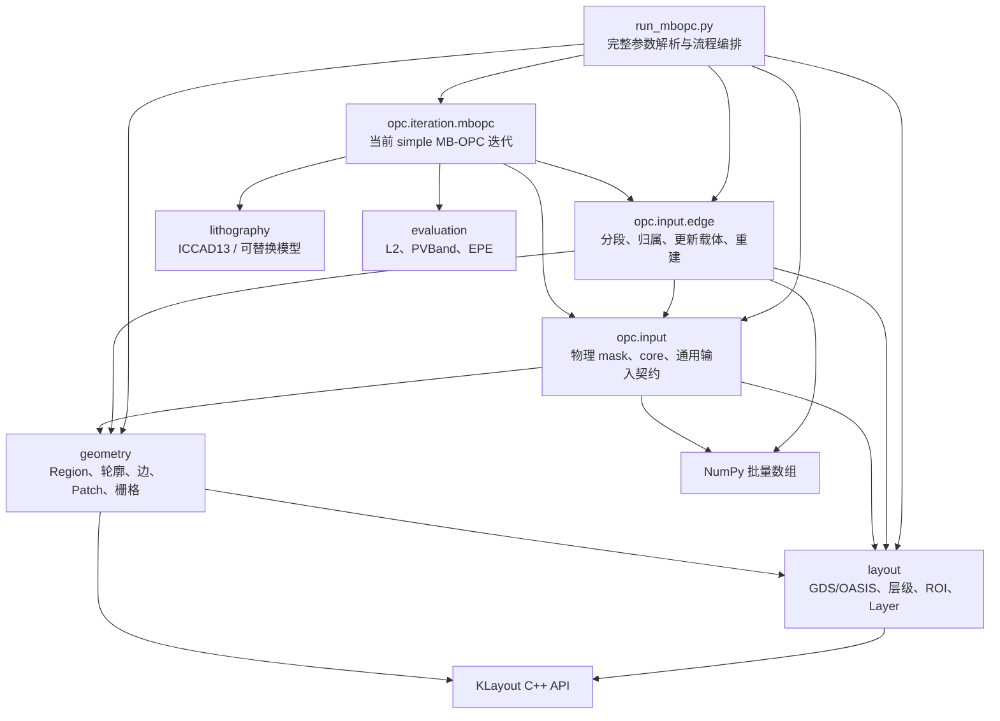
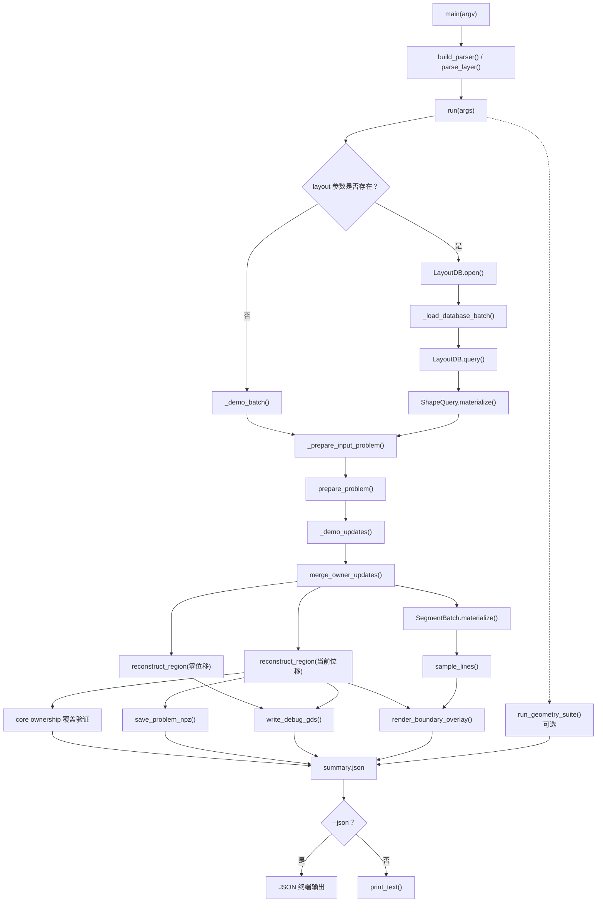
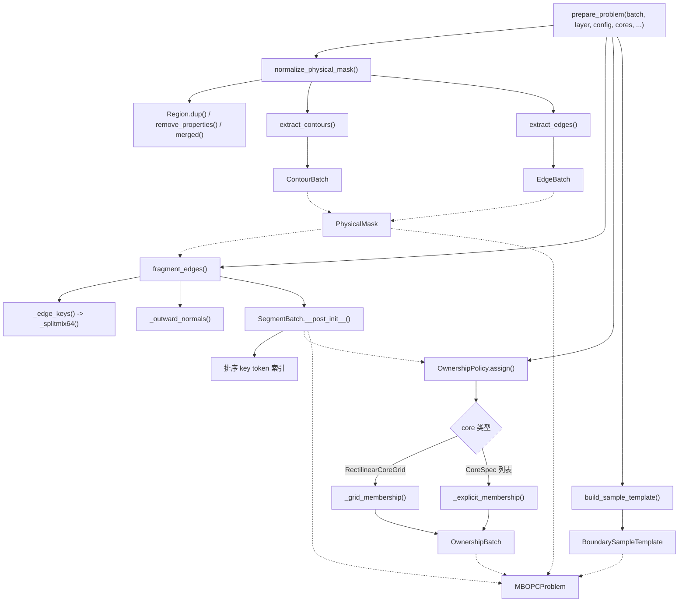
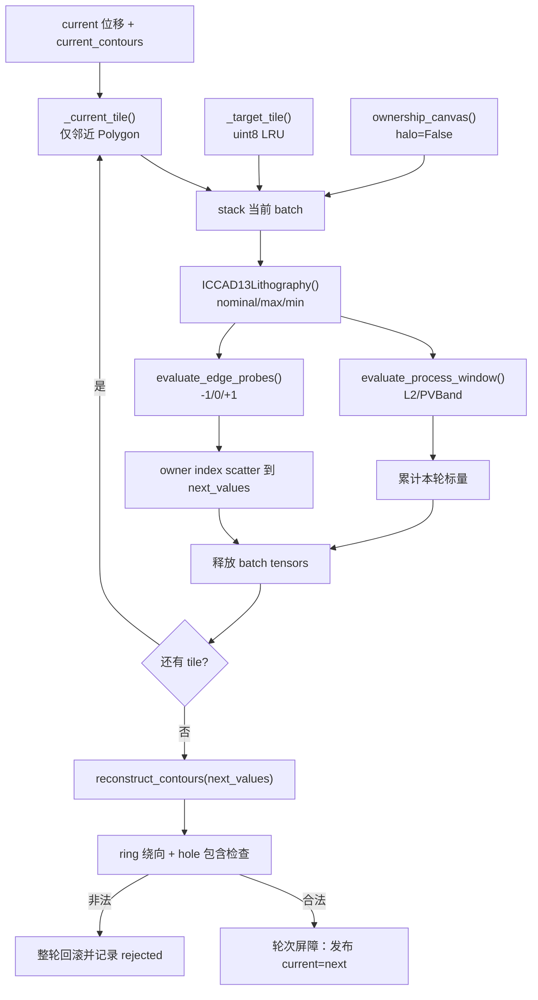
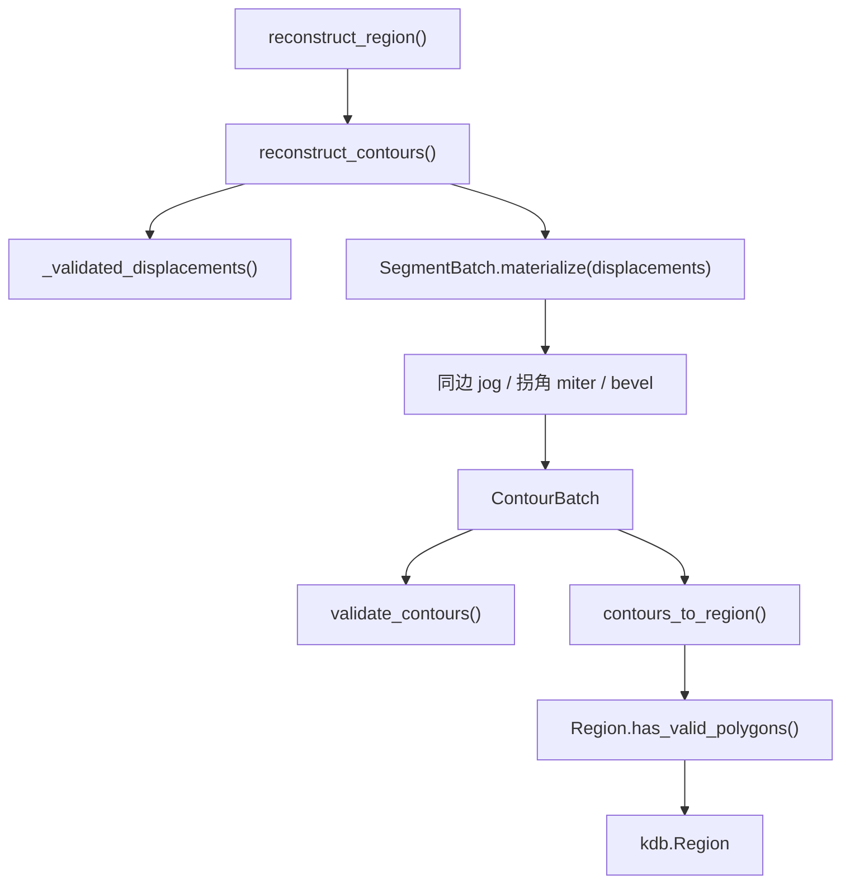
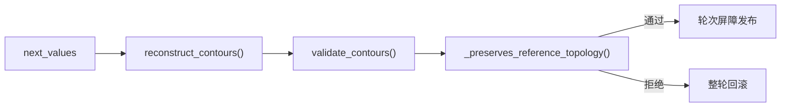
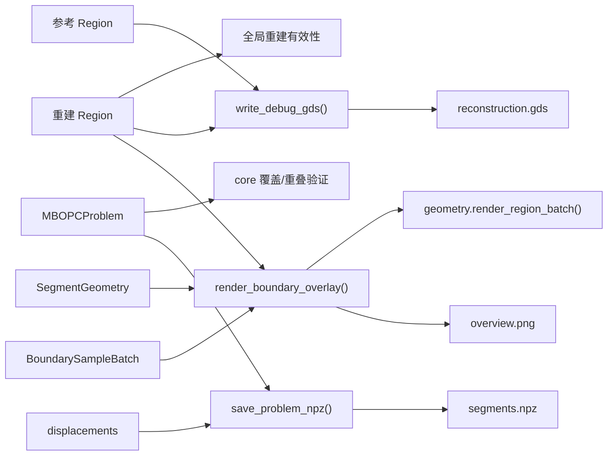
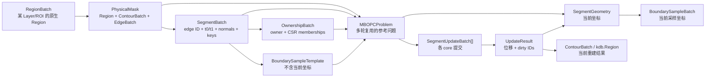
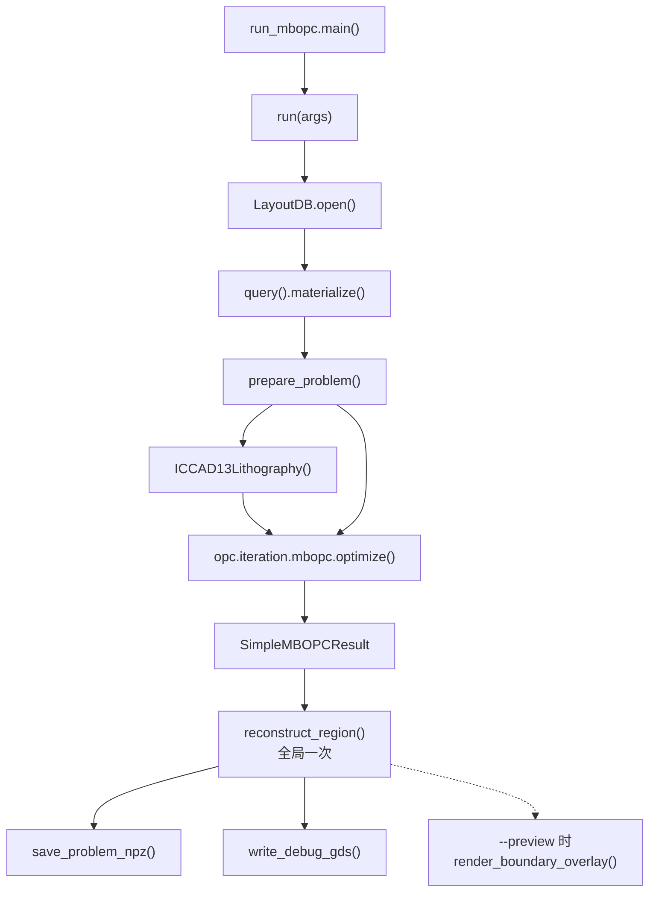
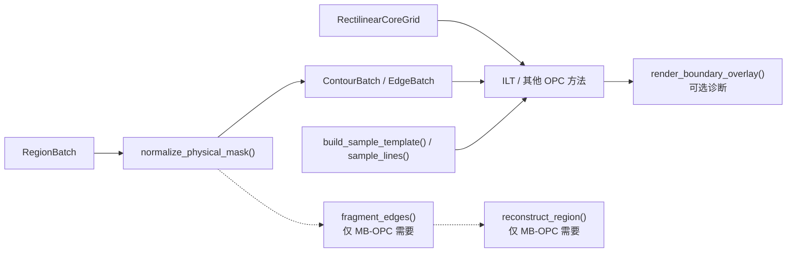

# MyOPC 函数调用关系与数据流

## 1. 文档用途

本文档回答四个问题：

1. 从 `run_mbopc.py` 开始，一次完整优化会调用哪些函数；前端验证入口与它有何区别？
2. 哪些函数每个任务只执行一次，哪些函数会在 OPC 优化迭代中重复执行？
3. `layout`、`geometry`、`opc.input` 和 `opc.input.edge` 之间通过什么数据对象衔接？
4. 未来增加 ILT、替换光刻模型、输入构造或 OPC 迭代时，应该接在哪一层？

图中实线箭头表示“直接调用”，虚线箭头表示“主要数据传递”或“可选调用”。

## 2. 分层依赖关系



这是单向依赖：

- `layout` 不知道任何 OPC 方法。
- `geometry` 只依赖 `layout` 的坐标、Layer 和批次契约。
- `opc.input` 可供 MB-OPC、ILT 和后续方法共用，不导入边段输入或具体迭代方法。
- `opc.input.edge` 向下复用通用输入层，不把自己的位移/重建规则泄漏到 `geometry`。
- `opc.iteration.<method>` 可独立更换，并组合顶层 `lithography` 与 `evaluation`；当前 simple MB-OPC、ICCAD13 和三类指标是实际调用方。
- CLI 是流程编排者，不是 solver 公共 API。库调用方应从 `prepare_problem` 开始。

## 3. 前端验证程序调用

本节描述 `run_mbopc_frontend.py` 的输入/重建验证，不执行光刻迭代；完整 `run_mbopc.py` 调用见第 10 节。



### 3.1 真实版图的生命周期

`LayoutDB.open()` 到 `prepare_problem()` 必须处于同一个 `with` 上下文中：

```text
LayoutDB 打开
  └─ ShapeQuery.materialize()
       └─ prepare_problem()
            └─ 建立独立 PhysicalMask + NumPy 数组
LayoutDB 关闭
  └─ 后续迭代、重建和输出不再访问源版图
```

原因是 `ShapeQuery.materialize()` 返回的原生 Region 在准备阶段仍与 KLayout 数据库生命周期相关。`prepare_problem()` 完成物理合并和紧凑数组构建后，后续计算即可脱离源文件。

## 4. `prepare_problem()` 内部调用树

`prepare_problem()` 是最重要的库入口，每个 Layer/ROI/配置组合通常只执行一次。



### 4.1 物理 mask 准备

| 函数 | 直接调用 | 输出 | 设计意图 |
|---|---|---|---|
| `normalize_physical_mask` | `RegionBatch.region`、KLayout `merged`、`extract_contours`、`extract_edges` | `PhysicalMask` | 消除内部 cut-line，恢复 hull/hole，不修改输入批次 |
| `extract_contours` | `_extract_layer` | `ContourBatch` | 把 Region 一次性转成 CSR 式轮廓数组 |
| `extract_edges` | NumPy 闭环索引 | `EdgeBatch` | 每个轮廓顶点对应一条有向数学边 |

### 4.2 边段准备

| 函数 | 直接调用 | 输出 | 设计意图 |
|---|---|---|---|
| `fragment_edges` | `_edge_keys`、`_outward_normals`、`SegmentBatch(...)` | `SegmentBatch` | 用 edge ID + `t0/t1` 保存分段，不常驻重复端点 |
| `_edge_keys` | `_splitmix64` | 每条数学边 128-bit key | key 只依赖 Layer 和有向端点，跨进程稳定 |
| `_outward_normals` | NumPy 环面积/方向计算 | edge 单位外法向 | hull 和 hole 都指向材料外的空区 |
| `SegmentBatch.__post_init__` | `_vector`、`_matrix`、`argsort` | 规范化数组 + key 查找索引 | 查找索引只构建一次，多轮复用 |

### 4.3 owner 与 halo context

| 函数 | 调用条件 | 输出 |
|---|---|---|
| `MidpointOwnerPolicy.assign` | `RectilinearCoreGrid` 进入快速路径 | `_grid_membership` 的 `OwnershipBatch` |
| `_grid_membership` | 规则 x/y cuts | 每段唯一 owner + 按 core 排列的 CSR membership |
| `_explicit_membership` | 少量不规则 `CoreSpec` | 显式 core 的 owner/context membership |
| `_validate_explicit_cores` | `_explicit_membership` 调用 | 拒绝空列表、重复 ID 和正面积 ownership 重叠 |

`OwnershipBatch.owner_indices` 与 `member_segment_indices` 含义不同：

- `owner_indices[segment]`：谁有权修改这个 segment，必须唯一。
- `segments_for_core(core)`：该 core 计算光学上下文时能看见哪些 segment，可在多个 core 中重复。

## 5. 优化迭代热路径

当前 `opc.iteration.mbopc.optimize()` 已实现同步 owner-only 的流式 simple MB-OPC。它不通过 stable key 重排本进程内更新，而是预分配与全局 segment 对齐的 `next_values`，按 owner index 直接 scatter；stable key/`merge_owner_updates()` 继续服务跨进程提交、checkpoint 和外部方法。



固定参考边中点/法向用于 EPE target 探针，当前 mask 则来自 `current_contours`。同轮所有 batch 只读同一个 `current`；只有全部 tile 结束并通过拓扑守卫，下一轮才能看到新位移。GPU 不保存整张 reticle tensor，每个 batch 之后只留下标量和 compact segment 方向。

### 5.1 `merge_owner_updates()`

`merge_owner_updates()` 是外部更新批次的公共入口；当前同进程 solver 为性能直接使用已经对齐的 owner segment index。外部入口内部调用 `SegmentBatch.lookup_keys()`，然后依次检查：

1. key 是否存在。
2. 提交者 core 是否在范围内。
3. 提交者是否是该 segment 的唯一 owner。
4. 同一轮是否对同一 segment 重复提交。
5. 绝对位移是否超过 `max_displacement_dbu`。

返回的 `UpdateResult` 包含：

- `displacements`：与全局 segment 对齐的绝对法向位移。
- `changed_segment_indices`：当轮变化的 segment。
- `dirty_polygon_ids`：可供后续增量重建/光学缓存失效使用。

### 5.2 `SegmentBatch.materialize()`

```text
edge_starts + (edge_ends - edge_starts) * t0/t1
  └─ + edge_normal * displacement
       └─ SegmentGeometry(starts, ends, normals, lengths)
```

调用时可传 `indices`，只物化某个 core 或某些 dirty segment；不传时物化全部 segment。

### 5.3 `sample_lines()`

`build_sample_template()` 在准备阶段预先生成 `line_indices`、切向位置和法向偏移。`sample_lines()` 每轮只做 `take` 和 NumPy 广播，并可重用调用方提供的 `out` 缓冲区。

`sample_lines()` 本身仍只负责坐标物化，不判断穿越；当前 solver 的 EPE 路径由 `evaluate_edge_probes()` 同时读取 target inner/outer 像素。2 nm 窄壁配 8 nm 探针时，穿入空区的长边 inner 点因 `target_inner=False` 失效，不会推动该边；靠近拐角的短段可能沿法向落入相邻壁，按其局部 target 语义独立判定。

### 5.4 固定画布与缓存

`rasterize_region_canvas()` 使用 KLayout 原生面积栅格，保持第 0 行对应低 Y，和探针 `(y-bottom)/pixel` 坐标一致。target tile 首次生成后量化为 uint8 放入受字节上限约束的 LRU，命中时恢复到 `[0,1]`。当前 tile 不物化完整 reticle Region，而是用 `target - reference_selected + current_selected` 只替换 context 内可能变化的 Polygon。

## 6. 轮廓重建调用链



`reconstruct_contours()` 的 junction 规则：

- 同一数学边、位移相同：不输出内部分割点，避免斜边 DBU 取整毛刺。
- 同一数学边、位移不同：输出前段终点和当前段起点，形成 jog。
- 不同数学边：优先使用解析交点 miter；平行或 miter 过长时使用 bevel。

### 6.1 当前拓扑验证的边界

公共 `validate_contours()` 检查零长边、零面积环和每个 polygon 的唯一 hull；`has_valid_polygons()` 检查 KLayout 是否能表示输出 Polygon。MB-OPC solver 在轮次发布前额外调用 `_preserves_reference_topology()`：

- 向量化比较参考/候选 ring 有向面积符号，拒绝矩形对边穿越造成的绕向翻转。
- 只对实际含 hole 的 Polygon 执行 KLayout 包含检查，拒绝外轮廓越过内轮廓。
- ring 数量、Polygon ID 与 hole 标志必须和固定参考拓扑逐项一致。
- 任何失败都不发布局部结果，而是整轮回滚并记录 `rejected_segments`。

这层约束属于具体 MB 位移语义，因此放在 solver 屏障而不是 `layout` 或基础 `geometry`。当前 v1 不做逐 Polygon 步长缩减；它优先保证不会提交半个 Polygon 的更新。不同 Polygon 彼此碰撞、受制造规则约束的最小宽度/间距仍属于未来 DRC/可行性检查范围，不能从现有守卫推断为已支持。



## 7. 输出与诊断调用关系



| 函数 | 是否进入 solver 热路径 | 用途 |
|---|---|---|
| core 覆盖验证 | 否 | 验证 ownership box 无空洞、无正面积重叠；不裁剪最终 Polygon |
| `save_problem_npz` | 否 | 保存可复现的纯数值调试状态 |
| `write_debug_gds` | 否 | 把参考/重建 mask 分别写入两个顶层 Cell |
| `render_boundary_overlay` | 否 | 绘制 mask、segment owner、core、法向和采样点 |
| `run_geometry_suite` | 否 | 运行确定性多图形零位移验证并生成图集 |

## 8. 核心数据对象关系



### 8.1 参考态与迭代态

| 类别 | 数据 | 生命周期 |
|---|---|---|
| 固定参考态 | `PhysicalMask`、`SegmentBatch`、`OwnershipBatch`、`BoundarySampleTemplate` | 任务准备后复用到优化结束 |
| 每轮变化态 | `displacements`、`UpdateResult` | 每次 solver 更新 |
| 按需物化态 | `SegmentGeometry`、`BoundarySampleBatch` | 光学评估或输出时创建，可复用缓冲区 |
| 最终/调试态 | `ContourBatch`、`kdb.Region`、NPZ/GDS/PNG | 最终输出或按需诊断 |

`MBOPCProblem` 使用 frozen dataclass 固定结构关系，但 NumPy 数组底层仍然是可变内存。上层 solver 应把 `problem` 内的参考数组当作只读数据，把所有优化状态放在独立 `displacements` 中。

## 9. 调用频率与性能重点

| 频率 | 函数 | 性能策略 |
|---|---|---|
| 每文件一次 | `LayoutDB.open` | 只解析一次 GDS/OASIS，保留层级 |
| 每 Layer/ROI 一次 | `ShapeQuery.materialize` | KLayout C++ 递归迭代，不在 Python 中 flatten |
| 每问题一次 | `normalize_physical_mask` | 合并、轮廓和边界缓存 |
| 每问题一次 | `fragment_edges` | 批量分段、法向和 key 构建 |
| 每问题一次 | `OwnershipPolicy.assign` | 规则网格不构建 segment×core 稠密矩阵 |
| 每任务一次 | 固定参考 `SegmentBatch.materialize` | EPE 中点/法向跨轮复用 |
| 每 target tile 首次 | `_target_tile` | uint8 LRU 有显式 CPU 字节上限 |
| 每 tile/每轮 | `_current_tile` | `searchsorted` 只提取邻近 Polygon，不扫描全局顶点 |
| 每 GPU batch | `ICCAD13Lithography` + evaluation | ownership 像素计分；只回传标量和方向 |
| 每轮候选 | `reconstruct_contours` | 重建紧凑全局轮廓，不创建完整 reticle Region/PNG/GDS |
| 每轮发布 | `_preserves_reference_topology` | 无 hole 走向量化面积路径；失败整轮回滚 |
| 最终一次 | `reconstruct_region` | 最佳位移全局重建，不沿 core 裁 Polygon |
| 调试或交付 | NPZ/GDS/PNG 函数 | 不进入 solver 热路径 |

## 10. 当前完整 MB-OPC 主调用

根入口 `run_mbopc.py` 的 `run()` 只做编排；输入构造、光刻、评价和迭代分别保持可替换：



`SimpleMBOPCResult.best_displacements` 对应已经实际评价过的状态，不会返回最后一轮尚未仿真的候选。评分按 `(EPE, L2, PVBand)` 字典序选择最佳轮次；报告同时保留所有轮次三项指标，不能因为 EPE 改善而隐去 PVBand 退化。

若只替换 MB 迭代策略，新实现放入另一个 `opc.iteration.<method>` 并消费相同 `MBOPCProblem`；若只替换输入构造，输出仍应维持固定参考 segment、唯一 owner、context membership 和全局位移对齐契约。光刻模型继续位于顶层 `lithography`，评价位于 `evaluation`，两者不得反向依赖具体 solver。

## 11. ILT 和其他方法的复用路径



ILT 如果使用像素 mask，可以在 `PhysicalMask.region` 上调用 `geometry.render_region_batch()`；如果使用边界评估，可直接复用 `ContourBatch`、`EdgeBatch` 和通用采样。它不应为了复用这些能力而依赖 `SegmentBatch` 或 MB 轮廓重建。

## 12. 源码导航

| 主题 | 文件 |
|---|---|
| 完整 MB-OPC 编排 | [`run_mbopc.py`](../run_mbopc.py) |
| 仅前端验证编排 | [`run_mbopc_frontend.py`](../run_mbopc_frontend.py) |
| 可复用准备入口 | [`opc/input/edge/builder.py`](../opc/input/edge/builder.py) |
| 物理 mask | [`opc/input/mask.py`](../opc/input/mask.py) |
| 固定画布栅格输入 | [`opc/input/raster.py`](../opc/input/raster.py) |
| core 和通用输入数据契约 | [`opc/input/types.py`](../opc/input/types.py) |
| 采样物化 | [`opc/input/edge/sampling.py`](../opc/input/edge/sampling.py) |
| 控制段切分 | [`opc/input/edge/fragmentation.py`](../opc/input/edge/fragmentation.py) |
| 控制段、归属和更新数据契约 | [`opc/input/edge/types.py`](../opc/input/edge/types.py) |
| owner 和 halo membership | [`opc/input/edge/ownership.py`](../opc/input/edge/ownership.py) |
| owner-only 更新合并 | [`opc/input/edge/updates.py`](../opc/input/edge/updates.py) |
| 轮廓重建 | [`opc/input/edge/reconstruction.py`](../opc/input/edge/reconstruction.py) |
| NPZ/GDS 产物 | [`opc/input/edge/artifacts.py`](../opc/input/edge/artifacts.py) |
| 标注可视化 | [`opc/input/edge/visualize.py`](../opc/input/edge/visualize.py) |
| 多图形验证套件 | [`opc/input/edge/verification.py`](../opc/input/edge/verification.py) |
| simple MB-OPC 配置/结果 | [`opc/iteration/mbopc/types.py`](../opc/iteration/mbopc/types.py) |
| 流式同步迭代与拓扑屏障 | [`opc/iteration/mbopc/solver.py`](../opc/iteration/mbopc/solver.py) |
| ICCAD13 Hopkins 光刻模型 | [`lithography/iccad13.py`](../lithography/iccad13.py) |
| L2/PVBand/EPE 评价 | [`evaluation/metrics.py`](../evaluation/metrics.py) |
| 层级版图生命周期 | [`layout/database.py`](../layout/database.py) |
| ROI 局部物化 | [`layout/query.py`](../layout/query.py) |
| Region/轮廓互转 | [`geometry/contour.py`](../geometry/contour.py) |
| 轮廓提边 | [`geometry/edge.py`](../geometry/edge.py) |
| 轮廓基础验证 | [`geometry/validate.py`](../geometry/validate.py) |
| 通用 Patch 输出（非正式 tile 结果） | [`geometry/patch.py`](../geometry/patch.py) |

## 13. 建议阅读顺序

1. 先阅读第 2、3 节，了解分层和完整流程。
2. 阅读第 4 节，理解为什么 `prepare_problem()` 是架构中心。
3. 阅读第 5 节，理解多轮优化时哪些数据保持不变。
4. 阅读第 6 节，理解轮廓重建和当前拓扑安全边界。
5. 阅读第 10 节理解当前根入口；替换方法时保持输入、模型、评价和迭代的单向依赖。
