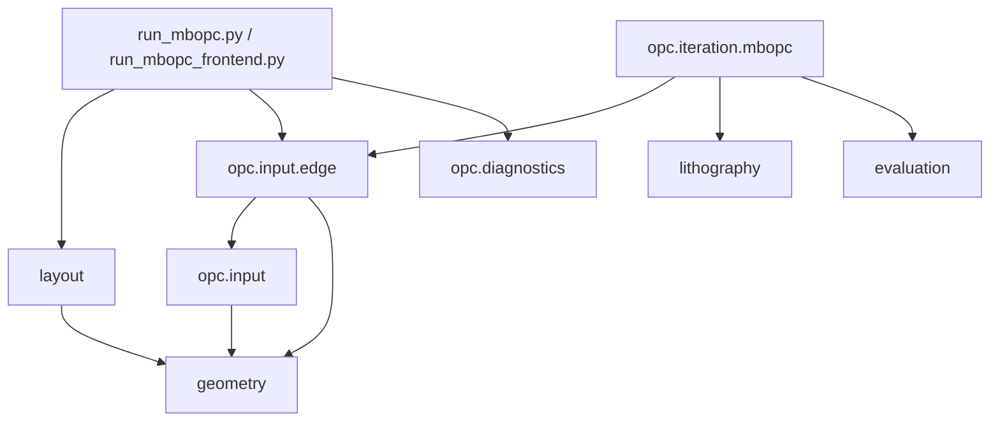
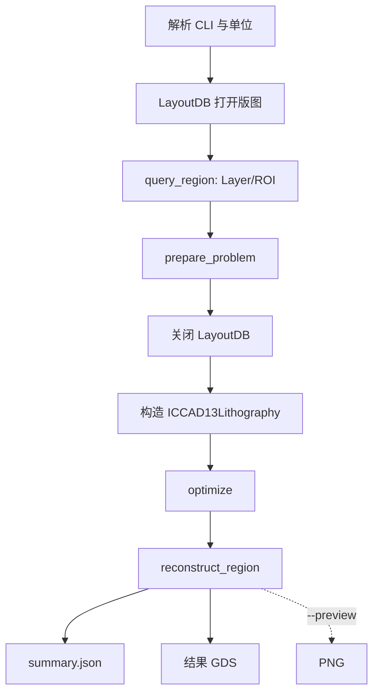
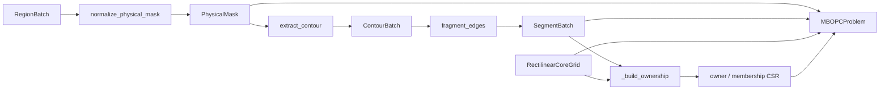
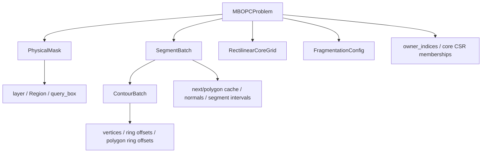
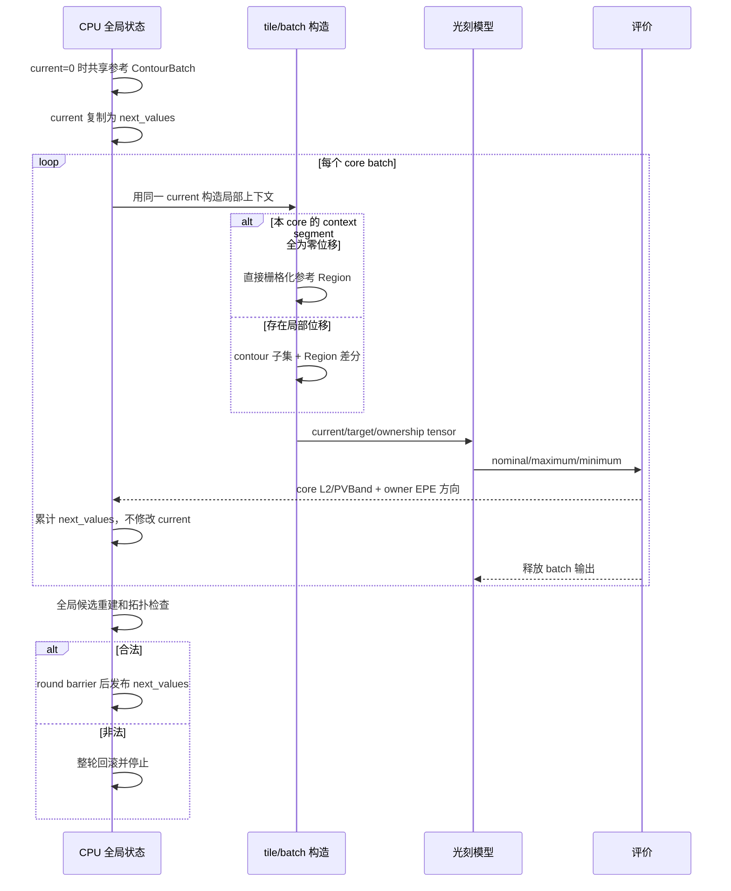
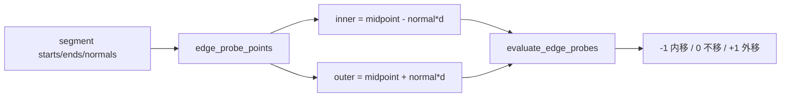
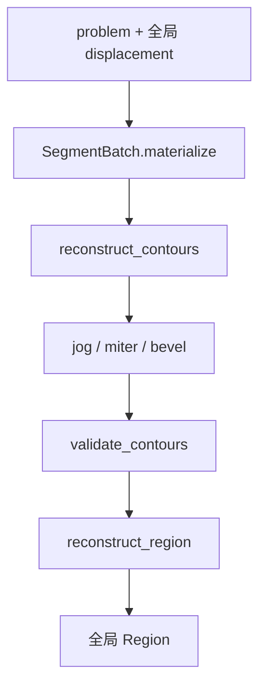
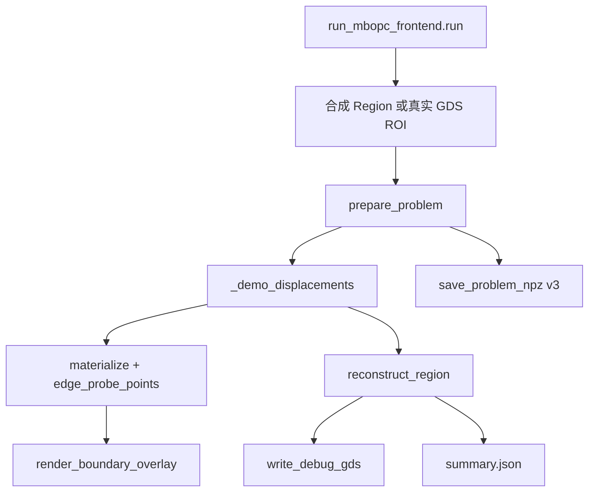
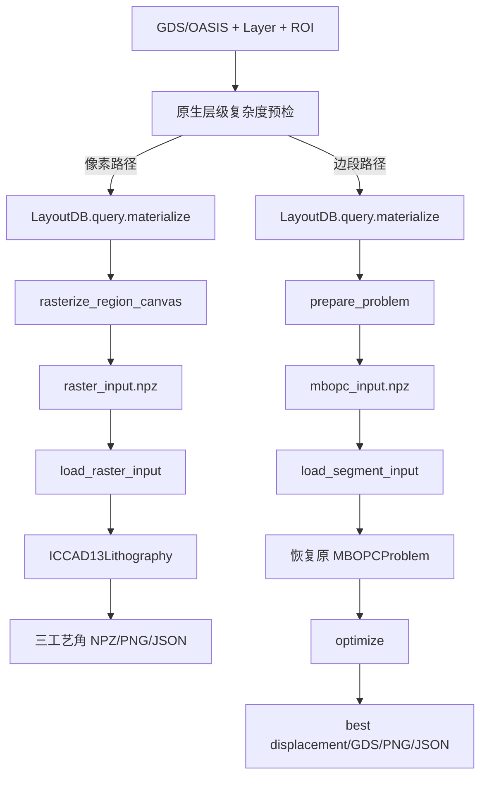

# MyOPC 函数调用关系与数据流

本文描述当前可执行代码，不保留已经删除的稳定键、外部更新批次、采样模板或可替换 owner 策略。

## 1. 分层依赖

主要源码：

- [完整入口](../run_mbopc.py)
- [前端验证入口](../run_mbopc_frontend.py)
- [共享输入类型](../opc/input/types.py)
- [边段类型](../opc/input/edge/types.py)
- [输入构造](../opc/input/edge/builder.py)
- [MB-OPC 求解器](../opc/iteration/mbopc/solver.py)
- [诊断输出](../opc/diagnostics.py)

## 2. 完整入口 `run_mbopc.run`

`run` 的关键输入是版图路径、Layer/ROI、物理 tile/halo/pixel 参数和迭代配置；输出是结果摘要字典，并在指定目录写 JSON/GDS/可选 PNG。它不写 NPZ。

版图数据库只在查询和 `prepare_problem` 期间保持打开。返回的 problem 是 NumPy/KLayout Region 组成的计算输入，后续迭代不再逐 core 调用层级查询。

## 3. 输入构造 `prepare_problem`

| 调用 | 输入 | 输出 | 作用 |
|---|---|---|---|
| `normalize_physical_mask` | ROI `RegionBatch`、Layer | `PhysicalMask` | 合并覆盖、规范孔洞，只保存 Layer/Region/ROI |
| `extract_contour` | 规范 Region | `ContourBatch` | 一次生成 Polygon/Ring 两级 CSR，不重复保存 Layer、polygon ID 或 hole 列 |
| `fragment_edges` | `ContourBatch`、`FragmentationConfig` | `SegmentBatch` | 建立两个紧凑 edge cache，并用 edge ID 和 `t0/t1` 表示控制段 |
| `_build_ownership` | `SegmentBatch`、规则 grid | 三组归属数组 | 由参数化参考端点确定唯一 owner 并建立 CSR halo membership；私有构造步骤 |
| `prepare_problem` | 上述输入 | `MBOPCProblem` | 提供唯一公共构造入口；不产生诊断文件 |

未传 grid 时，构造覆盖查询框的 1×1 `RectilinearCoreGrid`；没有另一套 explicit-core 分支。

## 4. 数据对象和引用关系

`PhysicalMask` 是原生物理覆盖，`SegmentBatch` 是数值控制自由度，二者不再重复暴露轮廓或数学边。`ContourBatch` 用 `polygon_ring_offsets` 表达每个 Polygon 的 hull/hole ring 范围；`SegmentBatch` 只持有热路径需要的 `edge_next_ids` 和 `edge_polygon_ids` 两个 `int32` 缓存。

`SegmentBatch.materialize(displacements)` 的输入是可选、长度等于 segment 数的浮点位移向量；输出 `SegmentGeometry(starts, ends, normals)`。该对象是当前计算批次，不常驻 problem，也不保存未使用的 lengths 或 indices。

## 5. 一轮 `optimize` 的调用顺序

内部主要调用：

1. `_target_tile` 从固定物理 mask 构造并缓存 uint8 target，直到整个 batch 送设备时才统一转为 float32；
2. `_current_tile` 同时接收本轮全局位移；局部全零时直接栅格化参考 Region，否则根据相关 polygon 构造当前 mask；
3. `ICCAD13Lithography.forward` 批量生成三种工艺条件；
4. `evaluate_process_window` 只在 core ownership 像素累计 L2/PVBand；
5. `edge_probe_points` 生成与当前 segment 顺序对齐的 inner/outer 坐标；
6. `evaluate_edge_probes` 返回有效、歧义和移动方向；
7. `_preserves_reference_topology` 在发布前检查 ring 绕向和 hole 关系。

“batch 完成后立即累计”不会提前移动边：tile 输入始终来自 `current`，更新只写 `next_values`，直到 round barrier 才可见。

target LRU 和 CPU batch 保存 `uint8`，current mask 保持未量化浮点覆盖率。零位移快路
只省略几何重建，不直接复用 target 数组；设备边界一次性归一化 target。`_owner_indices`
从每 core 的 membership CSR 中筛唯一 owner，不再反复扫描全局 segment。

`ICCAD13Lithography.forward` 对同一 mask 只做一次 FFT；focus 单位剂量强度供 nominal
与 maximum 共享，defocus 单独传播，三者按 dose² 缩放后进入 sigmoid。共享频谱只在
当前调用中存活，输出接口仍是 `LithographyResult`，因此求解器和独立工作台无需适配。

## 6. 探针和移动方向

法向恒指向 mask 外部。inner 应落在目标材料内，outer 应落在目标外；越界、落到同一像素或目标语义不成立时 probe 无效。相反证据同时成立时记录 ambiguous 并输出 0，以免同一个 probe 同时要求向内和向外。

2 nm 中空壁配 8 nm probe 时，inner 很可能穿过另一侧进入空区，因此长边 probe 被判无效，而不是用错误方向移动；角段的局部几何可能仍有效，测试按实际 target 语义判断。

## 7. 重建调用关系

位移始终相对一份固定参考边计算，不把上一轮整数重建结果重新切段。跨多个 core 的图形仍只有一套全局 segment 和一套位移；core 只控制计算与写权限，最终 Region 不按 core 裁剪后拼接。

若未来执行显式 remesh，旧数组下标不再有意义，调用方必须建立新的 problem 和优化状态；当前没有伪装成可跨 remesh 的稳定身份。

## 8. 前端验证器

`_demo_displacements` 直接生成全局下标对齐向量，用唯一 owner 选择演示移动，不模拟已经删除的外部提交协议。NPZ 只服务显式人工验证，字段按相同全局顺序对齐且不含稳定 key。

## 9. 输出与诊断边界

`opc.diagnostics` 包含：

- `save_problem_npz`：前端专用 v3 数值快照；
- `write_debug_gds`：参考/重建 GDS；
- `render_boundary_overlay`：标注图；
- `build_geometry_cases`、`run_geometry_suite`：多图形专项验证。

输入构造和求解热路径都不导入这些函数。只有根入口显式请求时，才计算诊断段长、图片、GDS 或完整几何图集。

## 10. 扩展位置

| 需求 | 应放位置 | 不应依赖 |
|---|---|---|
| 新光刻模型 | `lithography/<model>.py` | `opc.iteration.mbopc` |
| 新评价方法 | `evaluation/` | 某个根 CLI |
| 新边段 OPC 迭代 | `opc/iteration/<method>/` | 诊断文件格式 |
| ILT | 独立迭代目录，复用 mask/栅格/模型/评价 | `SegmentBatch`（除非算法确实使用边段） |
| 新输入表达 | `opc/input/` 下有实际调用方的模块 | 未实现方法的注册器 |

当前结构刻意不提供空基类、插件注册器、外部 key 更新层或多种 owner policy。需要第二个真实实现时，再从两个真实调用方提取最小公共接口。

## 11. 离线专项工作台调用关系

`prepare_*` 的输入是源版图、Layer、ROI 和离散化配置。raster 仍为 version 1，segment 归档为 version 2；`load_raster_input` 输出 `(mask, metadata)`，`load_segment_input` 输出 `(MBOPCProblem, metadata)`。metadata 只保存报告和物理单位信息，迭代权威数据仍是现有 problem 字段。

边段加载按以下顺序恢复并校验：`ContourBatch → SegmentBatch edge cache 校验 → RectilinearCoreGrid → contours_to_region → PhysicalMask → MBOPCProblem owner/membership CSR`。version 1 在读取新字段前即明确提示重新生成。完成后迭代入口直接调用现有 `optimize`；它不读取源 GDS，也不重新分段或重新分配 owner。
