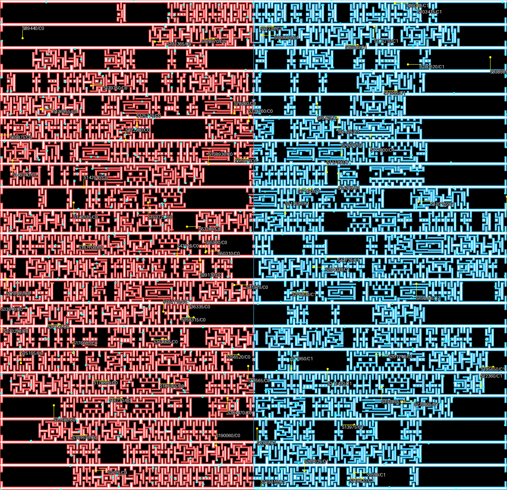

# MB-OPC 前端测试报告

## 1. 测试结论

当前 OPC 自动测试全部通过，OPC 包语句/分支综合覆盖率为 93%。全仓库回归、Ruff、compileall、直接外部工作目录运行、合成严格性能基准和真实 `gcd_45nm.gds` 处理均通过。

## 2. 环境

| 项目 | 值 |
|---|---|
| 日期 | 2026-08-09 |
| 系统 | Windows 10 19045 |
| CPU | AMD Ryzen 7 4800H，8C/16T |
| 内存 | 15.37 GiB |
| Python | 3.12.0 |
| KLayout | 0.30.10 |
| NumPy | 2.5.1 |

## 3. 自动测试覆盖

| 类别 | 关键场景 |
|---|---|
| 物理 mask | 重叠 cut-line 消除、角点接触分离、GDS 孔洞桥恢复 |
| 分段 | 长短边阈值、角段、中段均衡、斜边欧氏长度、稳定 key |
| 法向 | 外轮廓指向外部、孔洞指向孔内、单位长度 |
| core | x/y/四 core 跨界、精确分界点、最大外边界、halo CSR |
| 更新 | owner-only、未知 key、越界 core、重复提交、超限位移、坏 base |
| 重建 | 零位移、统一外扩、单段 jog、孔洞、斜边、非网格对齐斜边回归 |
| 层级集成 | Path、SREF、AREF、R90、mirror 经 LayoutDB 物化后进入 MB 前端 |
| 图形矩阵 | 正交凹形、孔洞/重叠、锐钝角斜边、负坐标长边、角点接触 |
| 随机回归 | 固定种子 100 组 Manhattan 矩形并集 |
| 产物 | JSON、无 pickle NPZ、双顶层 GDS、可读 PNG、相对图集路径 |
| 直接入口 | 合成模式、真实层级 GDS、外部 cwd 无安装执行 |

## 4. 覆盖率

`tests/opc` 共 37 项测试（最终门槛执行时更新）。最近一次完整 OPC 覆盖运行的综合结果为 93%，高于 90% 验收线。低覆盖行主要为难以稳定构造的哈希 token 碰撞、文件原子替换失败和 KLayout 原生无效 Region 防御。

## 5. 合成严格性能基准

| 指标 | 实测 |
|---|---:|
| 输入图形 | 5,000 |
| 数学边 / segment | 20,000 / 110,000 |
| core / membership | 64 / 134,734 |
| 问题准备 | 165.72 ms |
| 50,000 key 查找 | 12.30 ms，全部精确 |
| 坐标物化 | 17.99 ms |
| 零位移重建 | 522.87 ms |
| 紧凑常驻数组 | 6.41 MiB |
| 完全展开估算 | 11.33 MiB |
| 内存节省 | 43.43% |
| 零位移 XOR / 无 owner | 0 / 0 |

严格失败列表为空。内存门槛设为 40%，是因为保留排序 key 索引可避免每一轮更新重建查找状态，优先保障用户要求的运行速度。

## 6. `gcd_45nm.gds` 真实版图结果

| 指标 | 实测 |
|---|---:|
| Layer / DBU | 11/0 / 0.0001 μm |
| Polygon / Ring | 1,776 / 1,776 |
| 数学边 / segment | 21,590 / 223,553 |
| 2-core membership | 226,813 |
| 采样点 | 447,106 |
| 紧凑 segment 常驻数组 | 12,675,300 B（12.09 MiB） |
| 问题准备 | 282.89 ms |
| 更新+采样+双重建 | 699.13 ms |
| 产物输出 | 1.969 s |
| 总时间 | 2.951 s |
| 零位移 XOR / core 覆盖 XOR / core 正面积重叠 | 0 / 0 / 0 |

真实版图输出的 JSON、NPZ、PNG 和 GDS 均成功生成。标注图已人工检查：左右 core 归属分界清晰，所有物理边可见，抽样文字和点云没有遮蔽版图拓扑。

## 7. bug 回归与残余风险

- 已通过专用回归锁定非网格斜边的取整毛刺。
- 已通过小型层级 GDS 锁定真实文件分支的 LayoutDB 生命周期。
- 当前重建是几何前端，不包含光学模型、损失函数、优化器或工艺规则修饰；这些属于后续 MB-OPC solver 阶段。
- 真实性能数据受 CPU、防病毒扫描和磁盘影响，严格门槛故意宽于本机实测。

## 8. 目录重构回归

14 个既有 Python 文件已从 `opc/common`、`opc/mbopc` 移至 `opc/input`、`opc/input/edge`，没有新增源文件。移动后 37 项 OPC 测试与 81 项全仓库测试全部通过，OPC 综合语句/分支覆盖率保持 93%；Ruff 与 compileall 通过。

对 12 个非初始化生产模块执行了忽略导入与模块 docstring 的 AST 对比，逻辑差异为 0；两个初始化模块仅调整公共导出。`layout/`、`geometry/` 内容差异为 0，旧导入 `opc.common`、`opc.mbopc` 均不可解析，函数调用文档的 19 个相对源码链接全部有效。
