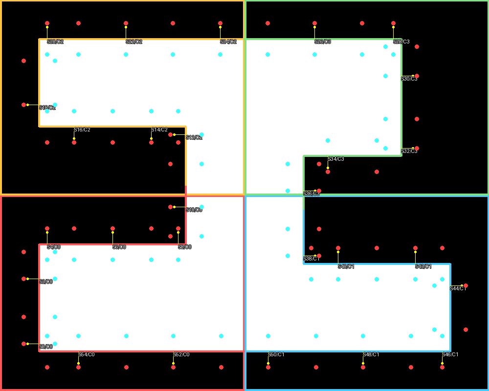
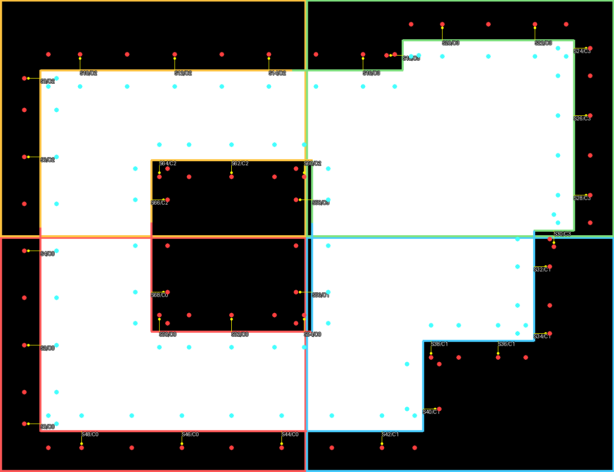
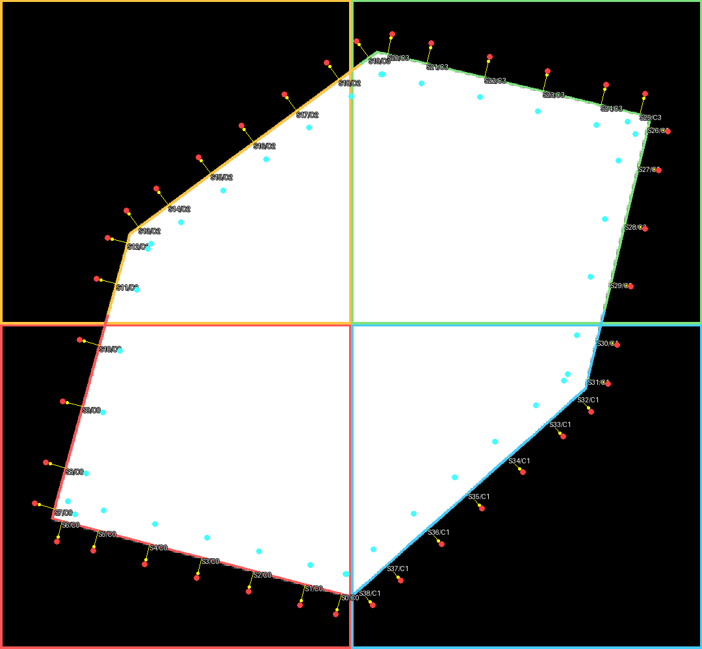
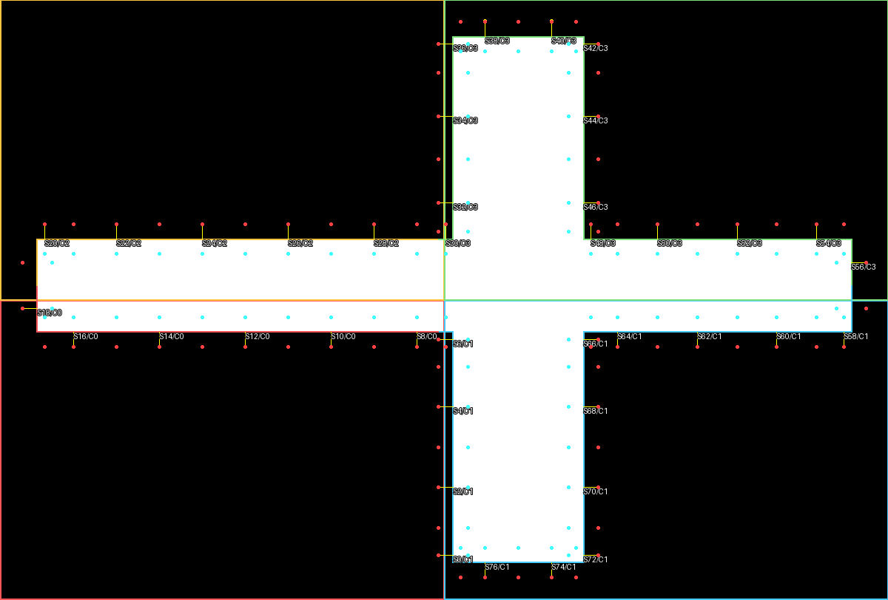
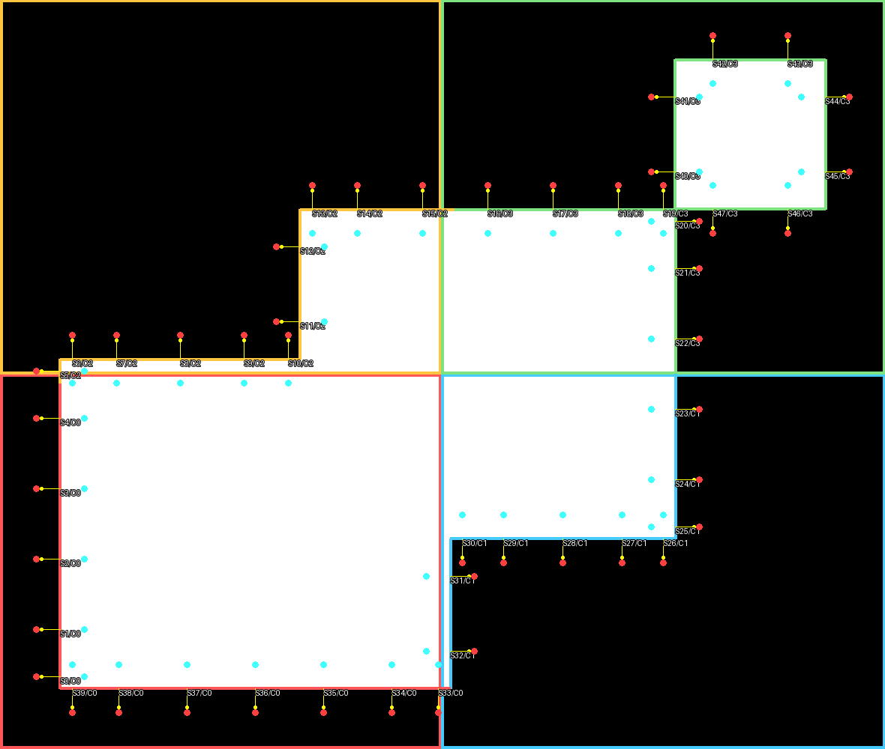

# MB-OPC 图形处理详细测试报告

## 1. 验证方法

图形套件使用 1 nm/DBU、角段 8 DBU、最大段长 25 DBU、最大位移 12 DBU 和 2×2 core。每个用例自动检查：

- 物理合并后的 Polygon/Ring/数学边计数。
- 所有控制段长度不超过 25 DBU。
- 每个 segment 都有唯一 owner，halo membership 可跨 core 重复。
- 零位移重建与物理 mask 的 XOR 面积为 0。
- 标注 PNG 可打开，且最大边至少 800 像素。

图中白色为 mask，边界颜色表示 owner core，黄色箭头是外法向，红/青点分别是正/负法向采样。

## 2. 定量结果

| 用例 | Polygon/Ring | Edge/Segment | Membership | 最大段长 | 零位移 XOR |
|---|---:|---:|---:|---:|---:|
| 正交凹形 | 1/1 | 12/56 | 70 | 25.000 | 0 |
| 孔洞与重叠 | 1/2 | 14/70 | 101 | 24.857 | 0 |
| 斜边锐钝角 | 1/1 | 6/39 | 55 | 24.504 | 0 |
| 负坐标跨 core 长边 | 1/1 | 12/78 | 127 | 25.000 | 0 |
| 重叠与角点接触 | 2/2 | 12/48 | 69 | 25.000 | 0 |

原始机读结果位于 [geometry_suite.json](images/mbopc/geometry_suite.json)。

## 3. 正交凹形

该用例同时包含 L/U 形凹口、长短边、内角与外角。内角外法向仍指向空区，跨越水平/垂直 core 线的边段保持连续。

## 4. 孔洞与重叠

外部矩形与右侧两个重叠矩形在规范化后成为单一外轮廓，内部矩形空区保留为 hole。孔洞边黄色法向指向孔内，证明“从材料指向空区”语义在 hull/hole 上一致。

## 5. 斜边与锐/钝角

六边形包含多种斜率和拐角角度，覆盖欧氏长度分段、解析拐角交点与非网格对齐端点。零位移不输出斜边内部取整点，因此 XOR 为 0。

## 6. 负坐标与跨 core 长边

水平长条和垂直长条合并成十字形，同时跨过 x/y 中心分界并含负坐标。每段只有一个 owner，但 membership 总数 127 高于 78 个 segment，证明 halo 能让邻近 core 同时看到跨界上下文。

## 7. 重叠、cut-line 与角点接触

左侧两个矩形有正面积重叠，内部 cut-line 被消除；右上角小矩形只与主体角点接触，物理规范化后仍为第二个 Polygon。这避免把无实际材料连接的角点粘成一个轮廓。

## 8. 额外自动覆盖

除上述可视化套件外，自动测试还包含：

- 100 组固定种子随机 Manhattan 矩形并集，全部零位移 XOR 为 0。
- GDS 孔洞 keyhole 桥：原始 10 点 hull 规范化为 4 边 hull + 4 边 hole，桥边不进入控制段。
- 层级 Path、SREF、AREF、R90 和镜像：物化后的全部物理图形可精确重建。
- 单个图形跨 x=53 core 分界：跨界 segment 同时在两个 halo 中，但仅一个 owner 能更新。
- 非网格对齐长斜边：专用回归防止相等位移的分割点取整毛刺复发。

## 9. 结论

定量 XOR、长度、key、owner、层级集成、随机组合与可视化检查一致通过。当前几何前端可作为后续 MB-OPC 光学评估和优化器的稳定输入层。
