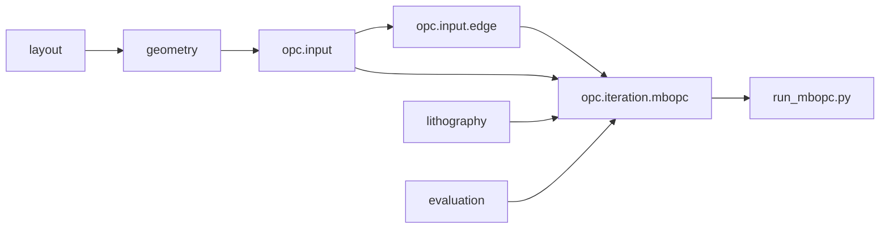
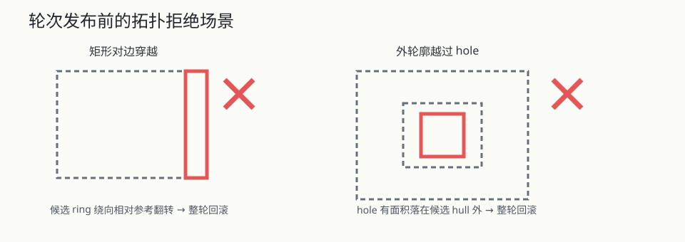

# Simple MB-OPC 迭代开发报告

## 1. 交付范围

本次交付把 OpenILT `opc/iccad13.py` 的实际 ICCAD13 Hopkins 光刻模型、L2/PVBand/EPE 评价和最简单的边段迭代迁入 MyOPC，并按整张 reticle 的有界内存目标重新组织。已交付：

- 顶层 `lithography/`：ICCAD13 配置、24 核 focus/defocus 资产、剂量窗口和 MIT 许可证。
- 顶层 `evaluation/`：ownership-only L2/PVBand 与批量 inner/outer EPE。
- `opc/input/raster.py`：固定画布、左下坐标、原生面积覆盖栅格。
- `opc/iteration/mbopc/`：同步 owner-only 流式迭代、最佳轮次、步长衰减、拓扑屏障。
- 根入口 `run_mbopc.py`：无需安装项目，直接从 GDS/OASIS 运行并输出 JSON/NPZ/GDS/可选 PNG。

未修改既有 `layout/` 和 `geometry/`。本次也没有实现完整 DRC、shot count、层级 cell variant 回写、不同 Polygon 间碰撞修复或 ILT 求解器，这些能力不能从当前结果中推断。

## 2. 架构与依赖



输入构造和具体迭代分离：`prepare_problem()` 只建立固定参考边、分段、key、owner 和 context membership；`optimize()` 只消费这些数据，不重新查询层级版图或重新提边。未来替换 MB 输入构造或迭代策略时，可分别保持另一侧契约不变。ILT 可共用 `PhysicalMask`、core/context、固定画布栅格、光刻模型和评价，不需要依赖 MB 位移重建。

## 3. 流式整图设计

每一轮的状态为与全局 segment 对齐的 `current`/`next_values` 和紧凑 `ContourBatch`，而不是整张 reticle 像素 tensor。每个 batch 执行：

1. 从 uint8 LRU 读取或生成固定 target tile。
2. 根据 context membership 找出邻近 Polygon，只提取其 rings/vertices。
3. 用 `target - reference_selected + current_selected` 生成当前局部 Region 并栅格化。
4. 把当前 batch 的 target、mask、ownership mask 放到设备上。
5. 运行 ICCAD13 nominal/max/min，累计 ownership 像素的 L2/PVBand。
6. 对 owner segments 的固定参考中点执行 inner/outer EPE，得到 `-1/0/+1`。
7. 按全局 owner segment index 直接 scatter 到 `next_values`，随后释放本 batch tensor。

CPU 常驻上界主要由参考 Region、紧凑 segment/owner 数组、两个位移向量、当前轮廓及受 `target_cache_bytes` 限制的 LRU 决定。GPU 常驻上界与 `batch_size × canvas² × Hopkins 中间量` 成正比，不随 reticle 总 tile 数增长。减小 `--batch-size` 只影响吞吐和峰值显存，不改变数学归属。

## 4. 同步更新与 core 语义

core 是计算、指标和更新责任边界，不是最终几何裁剪边界。同轮所有 tile 只读 `current`，owner 方向写入 `next_values`；最后一个 tile 结束前不会发布任何边。跨多个 core 的图形和斜边仍只有一套全局参考 segment/位移，halo 只读，最终最佳状态只全局重建一次，因此不会出现 core0/core1 同时移动同一边或两侧分别取整后接不上的问题。

`best_displacements` 始终对应已经实际完成光刻评价的状态。最后一轮生成但尚未评价的候选不会作为最佳输出，避免报告指标与 GDS 不一致。

## 5. EPE 与歧义规则

- inner target 应为材料；nominal 未打印时方向 `+1`，沿材料到空区的外法向外移。
- outer target 应为空区；nominal 已打印时方向 `-1`，沿外法向反向内移。
- inner/outer 同时违规时两个动作冲突，方向保持 0 并计入 `ambiguous`。
- 任一探针越界、两探针取整到同一像素、inner target 为空或 outer target 为材料时，探针无效且不移动。

2 nm 中空壁配 8 nm 探针时，长边 inner 点越过窄壁进入 hole，因此被 target 语义排除。靠近拐角的极短段沿自身法向可能仍落入相邻垂直壁，它是局部有效而不是算法误判，测试没有把所有 corner segment 强制归为无效。

## 6. 拓扑发布守卫

开发中复现了两个公共重建仍会接受的危险候选：矩形左边移动到右边右侧、以及中空图案外轮廓缩入 hole 内部。KLayout 可以把这两者规范成某个非零面积合法 Region，因此仅检查 `has_valid_polygons()` 不够。

solver 发布前新增 `_preserves_reference_topology()`：

- ring/Polygon/hole 元数据必须与固定参考逐项一致。
- 向量化比较每个 ring 的有向面积符号，拒绝对边穿越造成的绕向翻转。
- 仅对含 hole 的 Polygon 调用原生包含检查，hole 任意面积落在 hull 外即拒绝。
- 失败时整轮回滚，不提交部分 Polygon，也不生成补偿点或 bug 专用 wrapper。



当前守卫不替代完整 DRC：不同 Polygon 彼此重叠、最小间距/宽度、曲率和工艺规则仍需后续明确实现。

## 7. 性能取舍

- OpenILT 的光刻数学和实际使用资产保持一致，但移除了它的全图 tensor 假设和 256×256 `unpad` 错误。
- target 用 uint8 缓存，相对 float32 降低 75% 常驻字节；缓存命中恢复到 `[0,1]`，有专门回归。
- Polygon 局部提取使用有序 ID 的 `searchsorted` 和向量化区间展开，只处理当前 tile 选中的 rings/vertices；已删除每 tile 扫描全局轮廓的初版热点。
- ownership mask 逐 batch 生成并释放，避免在数百万 tile 场景中为所有 core 常驻布尔画布。
- v1 候选合法性采用整轮回滚，没有为了假设需求加入逐 Polygon 回退、注册器或空接口。

## 8. 直接运行

```powershell
$python = 'D:\app\miniforge\envs\myopc\python.exe'
& $python run_mbopc.py
```

整图示例：

```powershell
& $python run_mbopc.py TestReticle\gcd_45nm.gds `
  --layer 11/0 --iterations 3 --batch-size 8 `
  --output-dir .benchmarks\mbopc_gcd_full_3 --preview --json
```

完整参数和测试命令见 [测试手册](test_manual.md)，函数级数据流见 [调用关系文档](function_call_architecture.md)。

## 9. 简化与差异审计

- `layout/`、`geometry/` 内容差异为零。
- 没有新增 registry、backend facade、空方法目录或无调用方抽象。
- target 缓存归一化 bug 留有命中回归；旧错误路径没有遗留兼容分支。
- 四向 context 校验 bug 留有独立调用回归；没有复制 `CoreSpec` 包装层。
- 拓扑 bug 使用一个当前调用方的 solver 守卫解决，没有改变公共 geometry 语义。
- 根入口与前端演示入口职责不同：前者运行真实优化，后者验证输入/重建，不合并为带模式分支的复杂脚本。
- 三个可独立执行的根脚本各保留一个很小的 `parse_layer` 命令行边界函数；审计确认这是重复文本，但当前没有第三个库调用方需要共享 CLI 层。为消除几行解析而新增 `opc.cli` 抽象或改动既有入口属于过度设计，因此本次不做。
- 用户的 GDS、VS Code 配置、注释和无关未跟踪文件均未进入功能提交。

关键本地提交为 `a563449`（core 计算边界语义）、`6cf885a`（ICCAD13 与评价）和 `7485204`（流式迭代与根入口）；未推送远端。
