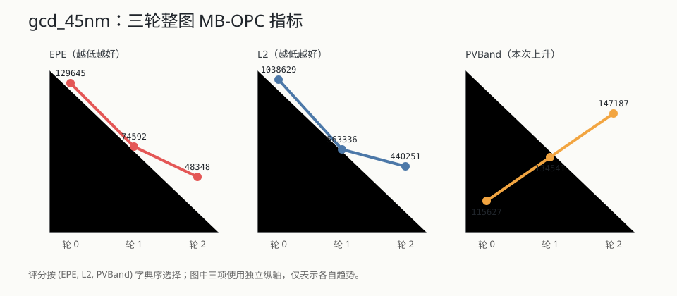

# Simple MB-OPC 迭代测试报告

## 1. 测试目标与环境

验证范围包括固定画布栅格、真实 ICCAD13 模型、EPE/L2/PVBand、同步 owner 更新、跨 core、缓存、非法拓扑、直接 CLI、`simple.gds` 和完整 `gcd_45nm.gds`。测试机使用 Python 3.12.0、KLayout 0.30.10、NumPy 2.5.1、PyTorch 2.5.1 CUDA 12.4；开发 GPU 为 NVIDIA GeForce GTX 1650，目标架构按 24 GiB GPU/64 GiB RAM 的整图机器设置有界内存，不依赖开发机能容纳整图 tensor。

## 2. 自动测试结果

专项命令：

```powershell
D:\app\miniforge\envs\myopc\python.exe -m pytest `
  tests\opc tests\lithography tests\evaluation `
  --cov=opc --cov=lithography --cov=evaluation --cov-branch `
  --cov-report=term-missing -q
```

实测 75 项通过，综合语句/分支覆盖率 92%。其中 `evaluation/metrics.py` 95%，`opc/iteration/mbopc/solver.py` 91%；最终全仓库 119 项通过。

## 3. 功能矩阵

| 类别 | 覆盖内容 | 结果 |
|---|---|---|
| 栅格 | 左下坐标、对齐矩形、hole、部分像素面积、空 Region、固定画布上界 | 通过 |
| 像素归属 | 四向 context、半开 core、halo 不计分 | 通过 |
| target LRU | 首次/命中一致、`[0,1]`、替换、字节计数、最旧驱逐、关闭缓存 | 通过 |
| 同步屏障 | batch 1 强制两个 core 分批；同轮读旧状态、下一轮才见新状态 | 通过 |
| owner | 跨 core segment 每轮只写一次，重复写 bitset 防护 | 通过 |
| EPE | inner、outer、歧义、越界、同像素、target 语义无效 | 通过 |
| 拓扑 | 重建异常整轮回滚、矩形对边穿越、hull 越过 hole | 通过 |
| 光刻 | OpenILT patch 零像素差、完整 256 修正、CPU/CUDA 直接运行 | 通过 |
| CLI | 仓库外工作目录直接 Python、物理晶格拒绝、NPZ/GDS/JSON | 通过 |

## 4. 关键几何场景

### 4.1 2 nm 中空壁与 8 nm 探针

构造外框 40×40 DBU、内孔 36×36 DBU，材料壁宽 2 DBU。长边 inner 探针越过材料进入 hole，`target_inner=False`，不产生方向。拐角短段可能沿法向仍位于相邻壁，因此局部有效；最终最佳位移保持零。该测试同时防止“把所有窄壁探针粗暴禁用”的过度修复。

### 4.2 外线移动到内线里面

构造 40×40 hull 与 20×20 hole，把所有 hull segment 内移 25 DBU。公共重建会产生一个 KLayout 可表示的 Region，但 hole 已不在 hull 内。solver 拓扑守卫检测 `hole - hull` 非空并拒绝整轮。

### 4.3 矩形左线越过右线

构造 20×20 矩形，把 x=0 左边向右移动 30 DBU。候选仍有非零面积，但 ring 绕向相对参考翻转；有向面积符号检查拒绝整轮。


### 4.4 跨 core 与斜边

既有回归覆盖控制段跨非分段点 core 边界、斜边跨多行多列和非整数解析交点。owner 通过参考中点唯一决定，两个 context 均可读；最终不按 core 裁 Polygon，而是从一套全局位移重建，因此零位移 XOR 为 0，不产生 33/34 DBU 两套裁剪端点。

## 5. `simple.gds` 实际 GPU 流程

配置：Layer 1/0，bbox `[-2000,-1100,-200,2200]` DBU，1024 nm tile，512 nm halo，8 nm/pixel，batch 2，三轮。

| 指标 | 轮 0 | 轮 1 | 轮 2 |
|---|---:|---:|---:|
| EPE | 338 | 203 | 113 |
| L2 | 2822.466 | 1766.541 | 1309.422 |
| PVBand | 388.928 | 415.595 | 436.144 |
| 有效探针 | 880 | 880 | 880 |
| 歧义探针 | 0 | 0 | 0 |

规模为 10 Polygon、107 数学边、885 segment、8 core；最佳轮次为 2，最终 Region 有效。峰值 CUDA allocated 68,238,848 字节，完整运行约 1.19 秒。EPE/L2 改善但 PVBand 上升，报告不把它描述为全指标单调优化。

## 6. 完整 `gcd_45nm` 整图验证

输入为只读 `TestReticle/gcd_45nm.gds` Layer 11/0，bbox `[11400,13150,317300,308850]` DBU。配置为 1024 nm tile、512 nm halo、8 nm/pixel、batch 8、三轮，共 30×29=870 core。

| 指标 | 轮 0 | 轮 1 | 轮 2 |
|---|---:|---:|---:|
| EPE | 129,645 | 74,592 | 48,348 |
| L2 | 1,038,629.522 | 563,335.522 | 440,251.431 |
| PVBand | 115,626.751 | 134,540.869 | 147,186.806 |
| 有效探针 | 223,298 | 223,298 | 223,298 |
| 歧义探针 | 51 | 5 | 2 |
| 已接受移动 | 129,594 | 74,587 | 48,346 |
| 单轮时间/s | 23.694 | 25.508 | 31.975 |



规模为 1,776 Polygon、21,590 数学边、223,553 segment、880,801 context membership。最终代码复跑的前端准备为 0.284 秒，迭代 81.671 秒，最终全局重建和产物 2.652 秒，总计 84.708 秒。紧凑 segment 数组 12,675,300 字节，峰值 CUDA allocated 271,544,320 字节；远低于开发机 4 GiB，更低于目标 24 GiB。最终 Region `has_valid_polygons=True`，GDS、NPZ、JSON 和 1200 像素标注 PNG 均成功生成并人工查看。

该测试证明内存上界不随整图像素面积常驻 GPU；它不证明 24 GiB 上的最大安全 batch，实际部署仍应从 batch 8 开始测量后逐步增大。

## 7. 最终质量门槛

最终已执行：

- 全仓库 `pytest -q`：119 项通过，13.54 秒。
- OPC/光刻/评价专项：75 项通过，综合语句/分支覆盖率 92%。
- 全范围 Ruff：通过；compileall：通过；`git diff --check`：通过。
- Python 模块/函数/测试函数中文 docstring、Markdown 相对链接与 Mermaid fence：通过。
- 未调用函数审计删除了无当前调用方的 `best_contours` 结果字段；宽泛异常、旧错误 wrapper 和补偿分支审计未发现新增残留。
- `git diff -- layout geometry` 为空；用户 GDS、图片、VS Code 和注释修改未暂存。
